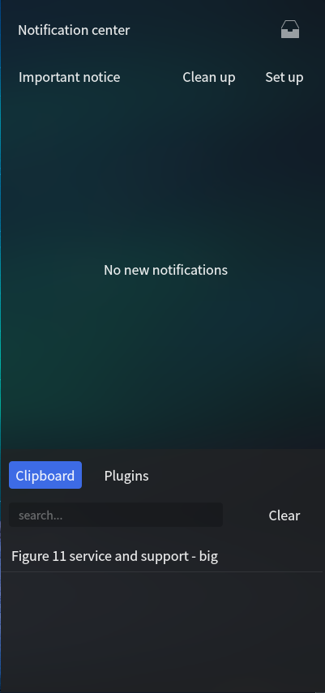
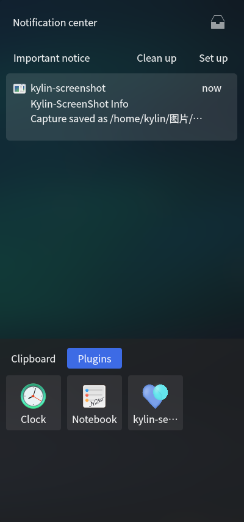
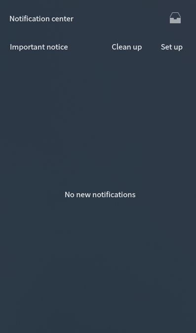
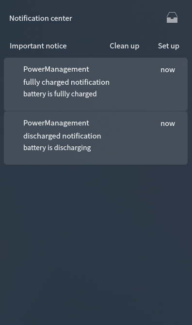
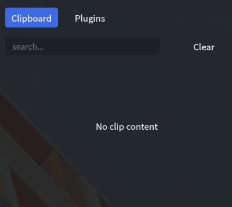
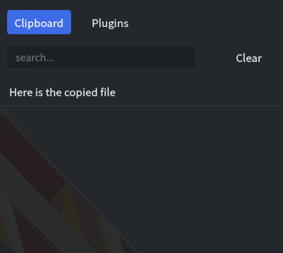
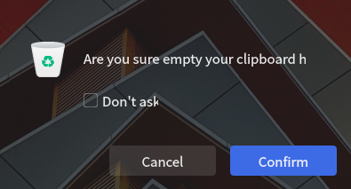
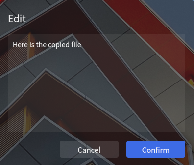
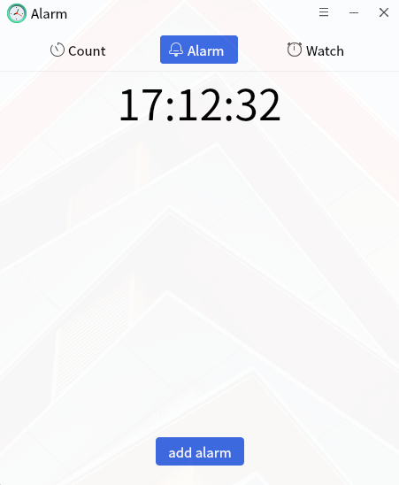
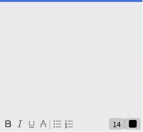

# ukui-sidebar
## Overview
The sidebar is one of the desktop environment software, which provides users with many convenient interactive functions. When the user uses the system, it receives the message notifications that the user has not had time to view, the clip-and-paste fields saved by the user's daily operations, as well as some small plugins for improving efficiency: alarm clock, Kirin notepad, service and support. The sidebar is hidden on the right side, and the way to open the sidebar is the dialog block icon for the position of the taskbar tray. The sidebar is the storage assistant in the operating system environment. Some convenient actions and notifications can be used directly in the sidebar. The main interface is shown in the figure.

  

## Message notification
The message notification is in the top half of the sidebar. By default, it says "No message notification". In the notification state, save the received message content, message number, and have the function of storage. And can according to the actual situation, empty the information content.

### Default state
- By default: prompt "No new notification received".

### Message notification status
-  Message bar prompt information: icon, display information source, information  title, part of information content, time of receiving information  (24-hour system of the day / 24-hour system of yesterday / 24-hour  system of this week / month and day for more than one week). 
- When hovering: the information can be stored (the information is stored in the storage box) and deleted.
-  Storage function (icon in the upper right corner): the stored information is  unimportant information; the number of stored information is displayed  by number, and when the number is more than 9, it is indicated by "..."; click the storage icon to display all the information in the  information area; click again to switch to the important information  list. 
-  Clear function: clear all the information in the current list. 
- Setting function: jump to the control panel notification setting interface.
- When the same application sends multiple notifications, the default is the folded  display effect, and the mouse clicks to expand; when the application is  in the expanded state, the mouse clicks the first notification to return to the folded effect.
- Before closing the sidebar, no matter in the main interface or the storage box interface, when you call it out again, it will not directly enter the storage box interface.

##  Clipboard 
-  The clipboard provides the function of saving the user's clip history, which can save the copied text, pictures, files, etc. 

###  Clipboard default state 
-  Default state: prompt "no clip content", search is not available. 

###  The clipboard has content status 
-  The search is available, and the copied text, picture and file (single or multiple) are supported; 

-  Hover the mouse over the content to edit, delete and fix the text (it will  not be emptied). Pictures and files do not support editing function; 

-  When the content exceeds the fixed height, a vertical slide bar will appear (scrolling by mouse and keyboard up and down keys); 

-  When the content of a text exceeds the specified width, the omitted part is indicated by "...". All the contents can be viewed in the editing window.

  

###  Clipboard clear function 
-  Clear the history of all clipboards except fixed items; click to open the clear confirmation interface. 

###  Clipboard editing function 
-  The text content can be modified in the pop-up edit window, and the modified content replaces the original copy item.
-  Double click the contents of the clipboard to execute the paste function. 

##  Plugin 
-  Provides a quick way to start plug-ins

###  Alarm clock 
-  Click the alarm clock icon to quickly pop up the alarm clock program, with countdown, alarm clock, stopwatch functions. 

### Kylin-notebook
-  Click the convenient signbook icon in the sidebar to open the notebook. Note book mainly realizes the function of recording information at any time. The basic editing options are: font size selection, font color, bold,  italics, underline, delete line, hierarchical display, palette and other functions. 

###  Service and support 

-  Service and support functions are mainly divided into: software introduction,  message consultation, contact us, self-service support. 

