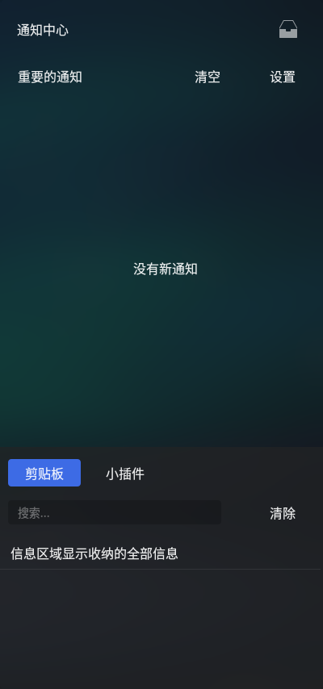
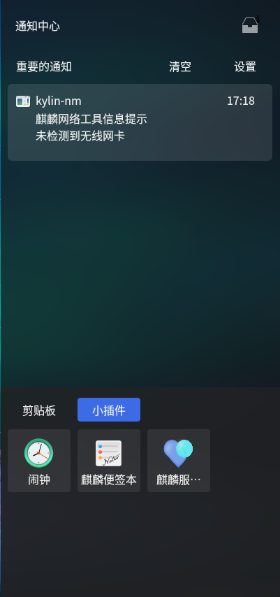
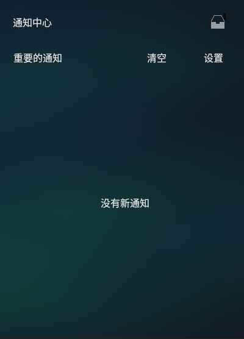
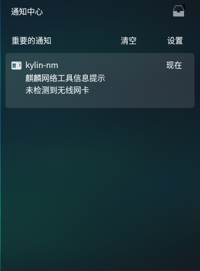
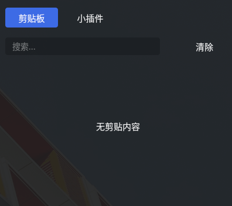
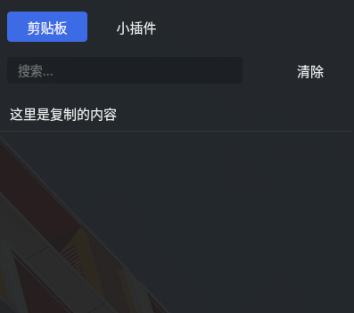
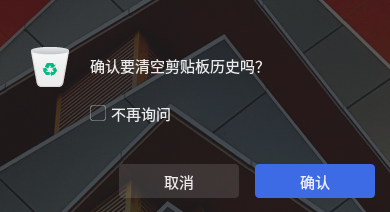
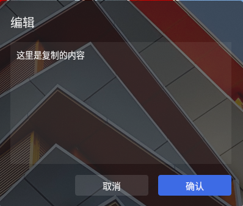
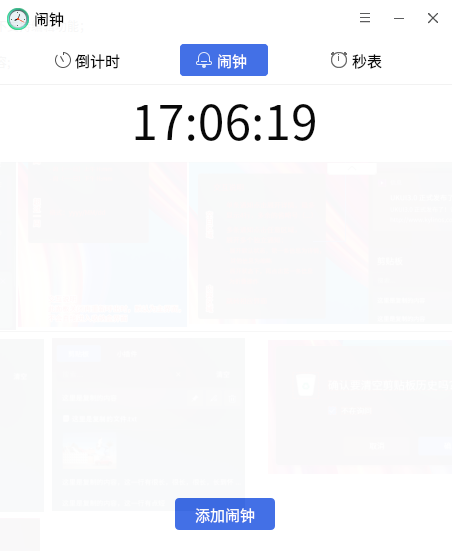
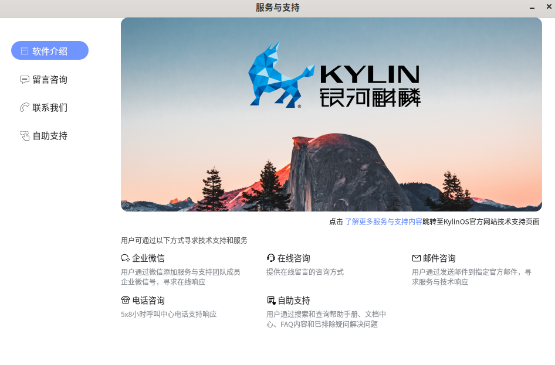

# 侧边栏
## 概 述
侧边栏是桌面环境软件之一，为用户提供了众多的便捷交互功能。在用户使用系统时，收纳用户未来得及查看的消息通知、用户日常操作保存的剪贴字段，以及一些针对提高效率的小插件：闹钟、麒麟便签本、服务与支持。侧边栏隐藏在右侧，打开侧边栏的方式是任务栏托盘位置的对话框图标。侧边栏是操作系统环境中的收纳助手，一些便捷操作与消息通知直接在侧边栏就可以使用。主界面如图所示。

  

## 消息通知
消息通知在侧边栏的上半部分。默认状态下，提示“没有消息通知”。有通知状态下，保存接收到的消息内容、消息数量，并有收纳的功能。并可根据实际情况，清空信息内容。

### 默认状态
- 默认状态下：提示“没有收到新通知”。

### 有消息通知状态
- 消息栏提示信息：图标、显示信息来源、信息标题、信息部分内容、接受信息的时间（当日24小时制/昨日24小时制/本周/超过一周用年月日） 。

- 鼠标悬停时：可进行对该信息收纳（信息被收纳到收纳盒中）、删除操作。

- 收纳功能（右上角图标）：收纳的信息为不重要信息；数字显示收纳信息的条数，当数字>9时，用“...”表示；点击收纳图标，信息区域显示收纳的全部信息内容；再次点击，切换到重要信息列表。

- 清空功能：清空当前列表下的所有信息。

- 设置功能：跳转到控制面板通知设置界面。

- 同一应用发送多条通知，默认为折叠显示效果，鼠标点击展开；展开状态时，鼠标点击第一条通知可返回折叠效果。

- 侧边栏关闭前,无论在主界面还是收纳盒界面,重新唤出时都为主界面,不会直接进入收纳盒界面。  

   

## 剪贴板
- 剪贴板提供保存用户剪贴历史记录的功能，可保存复制的文字、图片、文件等。

### 剪贴板默认状态
- 默认状态下：提示“无剪贴内容”，搜索处于不可用状态。

### 剪贴板有内容状态
- 搜索处于可用状态，支持复制的文字、图片、文件(单个、多个)等；

- 鼠标悬停该条内容上，可对文字进行编辑、删除、固定(不会被清空)操作,图片及文件不支持编辑功能；

- 当内容超过固定高度，出现竖向滑动条（通过鼠标、键盘上下键进行滚动）；

- 当一条文字内容超过规定宽度，其省略部分用"..."表示；可在编辑窗口中查看全部内容。

  

### 剪贴板清空功能
- 清空除固定项外的所有剪切板历史；点击弹出清空确认界面。

### 剪贴板编辑功能
- 文字内容可在弹出编辑窗口中进行修改,修改后的内容替换原有复制项。
- 鼠标双击剪切板内容则执行粘贴功能。

## 小插件
- 提供快捷的插件启动方式

### 闹 钟
- 点击闹钟图标可快速弹出闹钟程序，有倒计时、闹钟、秒表的功能。

### 麒麟便签本
- 点击侧边栏下方便签本图标即可打开便签本。便签本主要实现了用户随时记录信息的功能。基本编辑选项有：字号选择、字体颜色、加粗、斜体、下划线、删除线、分级显示、调色板等功能。

### 服务与支持

- 服务与支持功能主要分为：软件介绍、留言咨询、联系我们、自助支持。

